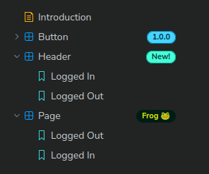

<div align="center">
  <picture style="display: flex; flex-direction: column; align-items: center;">
    <source src="./static/addon-example.avif" type="image/avif" />
    
  </picture>

  <h1>Storybook Addon - Tag Badges</h1>
  
  <p>
    This addon displays badges in the <a href="https://storybook.js.org/docs/configure/user-interface/sidebar-and-urls">sidebar</a> and <a href="https://storybook.js.org/docs/essentials/toolbars-and-globals">toolbar</a> of the Storybook UI, next to <code>component</code>, <code>docs</code> or <code>story</code> entries, based on the <a href="https://storybook.js.org/docs/writing-stories/tags">tags</a> defined in your content. Badges can be customised to support your team's workflows.
  </p>
  
  <p>
    
    <a href="https://github.com/Sidnioulz/storybook-addon-tag-badges/commits"></a>
    <a href="https://github.com/Sidnioulz/storybook-addon-tag-badges/commits"></a>
    <a href="https://github.com/Sidnioulz/storybook-addon-tag-badges/issues/"></a>
    <a href="https://github.com/Sidnioulz/storybook-addon-tag-badges/actions/workflows/github-code-scanning/codeql"></a>
    <a href="https://github.com/Sidnioulz/storybook-addon-tag-badges/actions/workflows/continuous-integration.yml"></a>
    <a href="https://codecov.io/gh/Sidnioulz/storybook-addon-tag-badges"></a>
    <a href="https://github.com/Sidnioulz/storybook-addon-tag-badges/graphs/contributors"></a>
    <a href="https://github.com/Sidnioulz/storybook-addon-tag-badges/blob/main/CODE_OF_CONDUCT.md"></a>
    <a href="https://github.com/Sidnioulz/storybook-addon-tag-badges/blob/main/LICENSE"></a>
    <a href="https://github.com/Sidnioulz/storybook-addon-tag-badges/network/members"></a>
    <a href="https://github.com/Sidnioulz/storybook-addon-tag-badges/stargazers"></a>
    <a href="https://github.com/sponsors/Sidnioulz"></a>
  </p>
</div>

---

## 📔 Table of Contents

<!-- no toc -->
- [Table of Contents](#-table-of-contents)
- [Which badge addon should I use?](#-which-badge-addon-should-i-use)
- [Installation](#-installation)
- [Default Config](#-default-config)
- [Usage](#-usage)
- [Customise Badge Config](#️-customise-badge-config)
- [Workflow Examples](#-workflow-examples)
- [Limitations](#-limitations)
- [Contributing](#-contributing)
- [Support](#-support)
- [Contact](#️-contact)
- [Acknowledgments](#-acknowledgments)

## 🤔 Which badge addon should I use?

A few other projects have been written to display badges in Storybook. This addon is a rewrite of [storybook-addon-badges](https://storybook.js.org/addons/@geometricpanda/storybook-addon-badges) from [Jim Drury](https://github.com/geometricpanda), focused on exploiting Storybook [tags](https://storybook.js.org/docs/writing-stories/tags). We use tags as a data source to display badges, rather than dedicated [story parameters](https://storybook.js.org/docs/writing-stories/parameters), as tags are becoming more prevalent in Storybook and have a strong role overlap with badges.

This architectural choice opens up new possibilities, but also prevents some features from the original addon from working. The table below summarises the differences between both addons.

|                             | storybook-addon-tag-badges | [storybook-addon-badges](https://storybook.js.org/addons/@geometricpanda/storybook-addon-badges) |
| --------------------------: | -------------------------- | ------------------------------------------------------------------------------------------------ |
|      Show badges in toolbar | ✅                          | ✅                                                                                                |
|      Show badges in sidebar | ✅                          | ⚠️ _only for current story_                                                                       |
| Define badges based on tags | ✅                          | ❌                                                                                                |
|     Per-story customisation | ❌                          | ✅                                                                                                |
|             Tooltip support | ⚠️ _only in toolbar_        | ✅                                                                                                |
|            Storybook >= 8.4 | ✅                          | ✅                                                                                                |
|             Storybook < 8.3 | ❌                          | ✅                                                                                                |

## 📦 Installation

```sh
yarn add -D storybook-addon-tag-badges
```

```sh
npm install -D storybook-addon-tag-badges
```

```sh
pnpm install -D storybook-addon-tag-badges
```

In your `.storybook/main.ts` file, add the following:

```ts
// .storybook/main.ts
export default {
  addons: ['storybook-addon-tag-badges'],
}
```

## 🏁 Default Config

This addon comes with a default config, allowing you to get started immediately by adding tags to your content.

### Preconfigured Badges

|                            Preview | Tag patterns                          | Suggested use                                                                                                      |
| ---------------------------------: | ------------------------------------- | ------------------------------------------------------------------------------------------------------------------ |
|         | `new`                                 | Recently added components or props/features                                                                        |
|        | `alpha`, `beta`, `rc`, `experimental` | Warn that a component or prop is not stable yet                                                                    |
|  | `deprecated`                          | Components or props that should be avoided in new code                                                             |
|    | `outdated`                            | Components with design changes that weren't yet implemented, which can incur extra development costs to your users |
|      | `danger`                              | Components that require particular attention when configuring them (e.g. for with security concerns)               |
|   | `code-only`                           | Components that only exist in code, and not in design                                                              |
|     | `version:*`                           | Per-component versioning                                                                                           |

### Display Logic

By default, all tags are always displayed on the toolbar, but they're only displayed for component entries in the sidebar.

Besides, the addon is limited to one badge per entry in the sidebar. Badges placed first in the configuration will be displayed in priority. For example, the `new` badge will be displayed before the `code-only` badge.

## 👀 Usage

To display preconfigured badges, add the relevant tags to your components, stories, or docs entries.

### Component Badges

To set badges for a component (and its child stories), define `tags` in the component's meta:

```ts
// src/components/Button.stories.ts
import type { Meta, StoryObj } from '@storybook/react'
import { Button } from './Button'

const meta: Meta<typeof Button> = {
  title: 'Example/Button',
  component: Button,
  tags: ['autodocs', 'version:1.0.0', 'new'],
}
```

### Story Badges

To add badges to a specific story, add `tags` to the story object itself:

```ts
// src/components/Button.stories.ts
export const Tertiary: StoryObj<typeof Button> = {
  args: {
    variant: 'tertiary',
    size: 'md',
  },
  tags: ['experimental'],
}
```

### Docs Badges

To set badges for a docs entry, pass a `tags` array to the [`docs` parameter](https://storybook.js.org/docs/writing-stories/parameters):

```ts
// src/components/Button.stories.ts
import type { Meta, StoryObj } from '@storybook/react'
import { Button } from './Button'

const meta: Meta<typeof Button> = {
  title: 'Example/Button',
  component: Button,
  parameters: {
    docs: {
      tags: ['outdated'],
    },
  },
}
```

## 🛠️ Customise Badge Config

In your manager file, you may redefine the config object used to map tags to badges. Each tag is only rendered once, with the first badge configuration it matches; therefore, make sure to place your overrides to the config first if you also want to keep the default config in place.

```ts
// .storybook/manager.ts
import { addons } from '@storybook/manager-api'
import {
  defaultConfig,
  type TagBadgeParameters,
} from 'storybook-addon-tag-badges'

addons.setConfig({
  tagBadges: [
    // Add an entry that matches 'frog' and displays a cool badge in the sidebar only
    {
      tags: 'frog',
      badge: {
        text: 'Frog 🐸',
        bgColor: '#001c13',
        fgColor: '#e0eb0b',
        tooltip: 'This component can catch flies!',
      },
      display: {
        sidebar: ['component'],
        toolbar: false,
      },
    },
    // Place the default config after your custom matchers.
    ...defaultConfig,
  ] satisfies TagBadgeParameters,
})
```

Let's now walk through the different properties of `tagBadges`. Each object in `tagBadges` represents a list of tags to match, and where a match is found, a badge configuration to use and places where the badge should be displayed.

### Tags

The `tags` property defines the tag patterns for which a badge will be displayed. It can be a single pattern or an array of patterns.

A tag pattern can be:

| Pattern type                   | Description                                | Example pattern        | Match outcome      |
| ------------------------------ | ------------------------------------------ | ---------------------- | ------------------ |
| `string`                       | Exact match                                | `'new'`                | `'new'`            |
| `RegExp`                       | Regular Expression                         | `/v\d+\d+\d+/`         | `'v1.0.0'`         |
| `{ prefix: string \| RegExp }` | Match part of a tag before a `:` separator | `{ prefix: 'status' }` | `'status:done'`    |
| `{ prefix: string \| RegExp }` | Match part of a tag after a `:` separator  | `{ suffix: 'a11y' }`   | `'compliant:a11y'` |

---

### Display

The `display` property controls where and for what type of content the badges are rendered. It has two sub-properties: `sidebar` and `toolbar`. In the sidebar, tags may be displayed for component, docs or story entries. In the toolbar, they may be set for docs or story entries (as other entry types aren't displayable outside the sidebar).

Each of these sub-properties can be set to:

| Type            | Description                        | Example    | Sidebar outcome                  | Toolbar outcome     |
| --------------- | ---------------------------------- | ---------- | -------------------------------- | ------------------- |
| `ø` _(not set)_ | Use default behaviour              |            | `['component']`                  | `['docs', 'story']` |
| `false`         | Never display tag                  | `false`    | `[]`                             | `[]`                |
| `true`          | Always display tag                 | `true`     | `['component', 'docs', 'story']` | `['docs', 'story']` |
| `string`        | Display only for one type of entry | `'docs'`   | `['docs']`                       | `['docs']`          |
| `string[]`      | Display for a list of entry types  | `['docs']` | `['docs']`                       | `['docs']`          |

---

### Badge

The `badge` property defines the appearance and content of the badge to display. It can be either a static object or a function that dynamically generates the badge based on the matched content and tag.

#### Static Badge Object

The object has the following properties:

| Name            | Type                             | Description                                    | Example                                                                                           |
| --------------- | -------------------------------- | ---------------------------------------------- | ------------------------------------------------------------------------------------------------- |
| **text**        | `string`                         | The text displayed in the badge (required).    | 'New'                                                                                             |
| **bgColor**     | `string?`                        | The CSS property passed to `background-color`. | '#aea'                                                                                            |
| **fgColor**     | `string?`                        | The CSS property passed to `color`.            | '#2f2'                                                                                            |
| **borderColor** | `string?`                        | A border colour, rendered as a CSS box-shadow. | '#2f2'                                                                                            |
| **tooltip**     | `string \| TooltipMessageProps?` | A tooltip shown on click in the toolbar only.  | `'This component is new!'` or `{ title: 'New Component', desc: 'Recently added to the library' }` |


#### Dynamic Badge Functions

Dynamic badge functions allow you to customize the badge based on the current entry and matched tag. They must return a valid badge object as documented above. They receive an object parameter with the following properties:

- `entry`: The current HashEntry (component, story, etc.), with an `id` and/or `name`, a `type`, and `tags`
- `getTagParts`, `getTagPrefix`, `getTagSuffix`: Utility functions to extract parts of the tag
- `tag`: The matched tag string

Example of a dynamic badge function:

```ts
// .storybook/manager.ts
import { addons } from '@storybook/manager-api'
import {
  defaultConfig,
  type TagBadgeParameters,
} from 'storybook-addon-tag-badges'

addons.setConfig({
  tagBadges: [
    {
      tags: { prefix: 'version' },
      badge: ({ entry, getTagSuffix, tag }) => {
        const version = getTagSuffix(tag)
        const isUnstable = version.startsWith('0')
        return {
          text: `v${version}`,
          bgColor: version.startsWith('0') ? '#f0ccff' : '#cce0ff',
          tooltip: `Version ${version}${isUnstable ? ' (unstable)' : ''}`,
        }
      },
    },
    ...defaultConfig,
  ] satisfies TagBadgeParameters,
})
```

### Tooltip

Badges may have a tooltip when displayed in the toolbar. The tooltip is disabled in the sidebar to avoid conflicting with the sidebar's function, though feedback is welcome on this.

You may pass a string to tooltips for a simple tooltip. You may also pass the same objects used by [Storybook's `TooltipMessage`](https://5ccbc373887ca40020446347-idzavsdems.chromatic.com/?path=/docs/tooltip-tooltipmessage--docs):

* `title`: The title of the tooltip *[string]*
* `desc`: Secondary text for the tooltip *[string]*
* `links`: An optional array of link objects displayed as buttons *[object[]]*
  * `title`: The title of the link
  * `href`: The URL to which the link points (navigates in-place)
  * `onClick`: A callback when the link is clicked (can be used to navigate in a new browser tab)

### Sidebar Label Customisations

This addon uses the [sidebar `renderLabel` feature](https://storybook.js.org/docs/configure/user-interface/sidebar-and-urls) to display badges in the sidebar. If you define it for other purposes in your Storybook instance, it will conflict with this addon and sidebar badges won't show.

To show badges for items that aren't customised by your own `renderLabel` logic, you may import the addon's own `renderLabel` function and call it at the end of your function.

```tsx
// .storybook/manager.ts
import { addons } from '@storybook/manager-api'
import type { API_HashEntry } from '@storybook/types'
import { renderLabel, Sidebar } from 'storybook-addon-tag-badges'

addons.setConfig({
  sidebar: {
    renderLabel: (item: API_HashEntry) => {
      // Customise your own items, with no badge support.
      if (item.name === 'Support') {
        return '🛟 Get Support'
      }

      // Customise items with badge support by wrapping in Sidebar.
      if (item.type === 'docs') {
        return <Sidebar item={item}>{item.name} [doc]</Sidebar>
      }

      // Badges for every item not customised by you.
      return renderLabel(item)
    },
  }
})
```


## 📝 Workflow Examples

This repository contains examples on how to support various workflows with Storybook badges:

- Market segmentation
- Separating functional from branded components
- Compliance state for checks like a11y, brand, QA
- Component composition patterns
- Use of external dependencies
- Smart components

To see these in action, check out the repository and run the local Storybook instance:

```sh
git clone https://github.com/Sidnioulz/storybook-addon-tag-badges.git
cd storybook-addon-tag-badges
pnpm i
pnpm start
```

## 🐌 Limitations

### Per-Story Config

This addon does not support changing the badge config for a specific story, and never will. This is because parts of the Storybook UI, like the sidebar, are rendered in a context where story data is not loaded. Storybook has stopped preloading all story data in v7, to improve performance.

As a result, we need to create sidebar tags without access to story-specific data. This addon uses the [core addon API](https://storybook.js.org/docs/addons/addons-api#core-addon-api) to read your configuration, and so the way to customise the rendering of a specific badge is to use [dynamic badge functions](<(#dynamic-badge-functions)>). Those functions can exploit a story's ID, title, or tag content to customise the rendered badge, as examples below will show.

### Component Tags

In Storybook, your MDX and CSF files are converted to `docs`, `component`, `group` and `story` entries to render the sidebar, each with their own semantics. `docs` and `story` entries directly inherit the tags defined in `parameters.docs.tags` and in the [CSF `meta`](https://storybook.js.org/docs/api/csf#default-export), respectively.

For `component` entries, tags are computed indirectly: they are the intersection of tags present on all of the component's stories. For example, for a component that defines the tag `version:1.2.0` in its `meta`, and has one story that defines an additional tag `deprecated`, the component entry will only have the `version:1.2.0` tag defined.

In particular, if a component `meta` defines two tags `outdated` and `version:1.1.0`, but one story explicitly removes the tag `outdated` (by adding `!outdated`), then the component entry will only have tag `version:1.1.0`.

## 👩🏽‍💻 Contributing

### Code of Conduct

Please read the [Code of Conduct](https://github.com/Sidnioulz/storybook-addon-tag-badges/blob/main/CODE_OF_CONDUCT.md) first.

### Developer Certificate of Origin

To ensure that contributors are legally allowed to share the content they contribute under the license terms of this project, contributors must adhere to the [Developer Certificate of Origin](https://developercertificate.org/) (DCO). All contributions made must be signed to satisfy the DCO. This is handled by a Pull Request check.

> By signing your commits, you attest to the following:
>
> 1. The contribution was created in whole or in part by you and you have the right to submit it under the open source license indicated in the file; or
> 2. The contribution is based upon previous work that, to the best of your knowledge, is covered under an appropriate open source license and you have the right under that license to submit that work with modifications, whether created in whole or in part by you, under the same open source license (unless you are permitted to submit under a different license), as indicated in the file; or
> 3. The contribution was provided directly to you by some other person who certified 1., 2. or 3. and you have not modified it.
> 4. You understand and agree that this project and the contribution are public and that a record of the contribution (including all personal information you submit with it, including your sign-off) is maintained indefinitely and may be redistributed consistent with this project or the open source license(s) involved.

### Getting Started

This project uses PNPM as a package manager, and Turbo as a monorepo provider.

- See the [installation instructions for PNPM](https://pnpm.io/installation)
- Run `pnpm i`

### Useful commands

- `pnpm start` starts the local Storybook
- `pnpm build` builds and packages the addon code
- `pnpm pack:local` makes a local tarball to be used as a NPM dependency elsewhere
- `pnpm test` runs unit tests

### Migrating to a later Storybook version

If you want to migrate the addon to support the latest version of Storyboook, you can check out the [addon migration guide](https://storybook.js.org/docs/addons/addon-migration-guide).

### Release System

This package auto-releases on pushes to `main` with [semantic-release](https://github.com/semantic-release/semantic-release). No changelog is maintained and the version number in `package.json` is not synchronised.

## 🆘 Support

Please [open an issue](https://github.com/Sidnioulz/storybook-addon-tag-badges/issues/new) for bug reports or code suggestions. Make sure to include a working Minimal Working Example for bug reports. You may use [storybook.new](https://new-storybook.netlify.app/) to bootstrap a reproduction environment.

## ✉️ Contact

Steve Dodier-Lazaro · `@Frog` on the [Storybook Discord](https://discord.gg/storybook) - [LinkedIn](https://www.linkedin.com/in/stevedodierlazaro/)

Project Link: [https://github.com/Sidnioulz/storybook-addon-tag-badges](https://github.com/Sidnioulz/storybook-addon-tag-badges)

## 💛 Acknowledgments

### Thanks

- [Jim Drury](https://github.com/geometricpanda) for his groundbreaking working on the original Badges Addon; I am a mere copy-cat
- [Michael Shilman](https://github.com/shilman) for his help with addon internals and his feedback
- All the contributors to the [Storybook addon kit](https://github.com/storybookjs/addon-kit)

### Built With

[](https://github.com/dependabot)
[](https://eslint.org/)
[](https://github.com/solutions/ci-cd)
[](https://prettier.io/)
[](https://github.com/semantic-release/semantic-release)
[](https://storybook.js.org/)
[](https://tsup.egoist.dev/)
[](https://www.typescriptlang.org/)
[](https://https://vitest.dev/)
