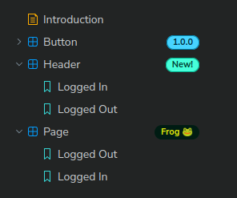

<div align="center">
  <picture style="display: flex; flex-direction: column; align-items: center;">
    <source src="./static/addon-example.avif" type="image/avif" />
    
  </picture>

  <h1>Storybook Addon - Tag Badges</h1>
  
  <p>
    This addon displays badges in the <a href="https://storybook.js.org/docs/configure/user-interface/sidebar-and-urls">sidebar</a> and <a href="https://storybook.js.org/docs/essentials/toolbars-and-globals">toolbar</a> of the Storybook UI, next to <code>component</code>, <code>docs</code> or <code>story</code> entries, based on the <a href="https://storybook.js.org/docs/writing-stories/tags">tags</a> defined in your content. Badges can be customised to support your team's workflows.
  </p>
  
  <p>
    
    <a href="https://github.com/Sidnioulz/storybook-addon-tag-badges/commits"></a>
    <a href="https://github.com/Sidnioulz/storybook-addon-tag-badges/commits"></a>
    <a href="https://github.com/Sidnioulz/storybook-addon-tag-badges/issues/"></a>
    <a href="https://github.com/Sidnioulz/storybook-addon-tag-badges/actions/workflows/github-code-scanning/codeql"></a>
    <a href="https://github.com/Sidnioulz/storybook-addon-tag-badges/actions/workflows/continuous-integration.yml"></a>
    <a href="https://codecov.io/gh/Sidnioulz/storybook-addon-tag-badges"></a>
    <a href="https://github.com/Sidnioulz/storybook-addon-tag-badges/graphs/contributors"></a>
    <a href="https://github.com/Sidnioulz/storybook-addon-tag-badges/blob/main/CODE_OF_CONDUCT.md"></a>
    <a href="https://github.com/Sidnioulz/storybook-addon-tag-badges/blob/main/LICENSE"></a>
    <a href="https://github.com/Sidnioulz/storybook-addon-tag-badges/network/members"></a>
    <a href="https://github.com/Sidnioulz/storybook-addon-tag-badges/stargazers"></a>
    <a href="https://github.com/sponsors/Sidnioulz"></a>
  </p>
</div>

---

## Which badge addon should I use?

Other addons have been written to display badges in Storybook. In particular, this here addon is a rewrite of [storybook-addon-badges](https://storybook.js.org/addons/@geometricpanda/storybook-addon-badges), which has a large following.

This here addon uses [tags](https://storybook.js.org/docs/writing-stories/tags) as a data source to display badges, rather than dedicated [story parameters](https://storybook.js.org/docs/writing-stories/parameters) like storybook-addon-badges does. This architectural choice opens up new possibilities, but also prevents some features from the original addon from working. The table below summarises the differences between both addons.

|   Feature                 : | storybook-addon-tag-badges | storybook-addon-badges     |
| --------------------------: | -------------------------- | -------------------------- |
|      Show badges in toolbar | ✅                          | ✅                          |
|      Show badges in sidebar | ✅                          | ⚠️ *only for current story* |
| Define badges based on tags | ✅                          | ❌                          |
|     Per-story customisation | ❌                          | ✅                          |
|             Tooltip support | ⚠️ *only in toolbar*        | ✅                          |
|            Storybook >= 8.4 | ✅                          | ✅                          |
|            Storybook <  8.3 | ❌                          | ✅                          |


## Installation

```sh
yarn add -D storybook-addon-tag-badges
```

```sh
npm install -D storybook-addon-tag-badges
```

```sh
pnpm install -D storybook-addon-tag-badges
```

In your `.storybook/main.ts` file, add the following:

```ts
export default {
  addons: ['storybook-addon-tag-badges'],
}
```

## Usage


### Default Config

### Component Badges
To set badges for a component (and its child stories), define `tags` in the component's meta:

```ts
// src/components/Button.stories.ts
import type { Meta, StoryObj } from '@storybook/react'
import { Button } from './Button'

const meta: Meta<typeof Button> = {
  title: 'Example/Button',
  component: Button,
  tags: ['autodocs', 'version:1.0.0', 'new'],
}
```

### Story Badges
To add badges to a specific story, add `tags` to the story export itself:

```ts
// src/components/Button.stories.ts
// TODO
```

### Docs Badges
To set badges for a docs entry, pass a `tags` array to the [`docs` parameter](https://storybook.js.org/docs/writing-stories/parameters):

```ts
import type { Meta, StoryObj } from '@storybook/react'
import { Button } from './Button'

const meta: Meta<typeof Button> = {
  title: 'Example/Button',
  component: Button,
  parameters: {
    docs: {
      tags: ['outdated'],
    },
  },
}
```

## Limitations

TODO: explain why cant use per story parameters

## Configuration

### Customise Badge Config


In your `.storybook/manager.ts` file, add the following:

```ts
import { addons } from '@storybook/manager-api'
import { defaultConfig, type TagBadgeParameters } from 'storybook-addon-tag-badges'

addons.setConfig({
  tagBadges: [
    {
      tags: 'frog',
      badge: {
        text: 'Frog 🐸',
        bgColor: '#001c13',
        fgColor: '#e0eb0b',
        tooltip: 'This component can catch flies!',
      },
      display: {
        sidebar: ['component'],
        toolbar: true,
      },
    },
    // Place the default config last so that
    // your custom matchers match first.
    ...defaultConfig,
  ] satisfies TagBadgeParameters,
})
```

## Development scripts

- `pnpm start` starts the local Storybook
- `pnpm build` builds and packages the addon code
- `pnpm pack:local` makes a local tarball to be used as a NPM dependency elsewhere
- `pnpm test` runs unit tests

## Bug reports

To report a bug, please use GitHub issues on this repository, making sure to include a working Minimal Working Example. You may use [storybook.new](https://new-storybook.netlify.app/) to bootstrap a reproduction environment.

### Migrating to a later Storybook version

If you want to migrate the addon to support the latest version of Storyboook, you can check out the [addon migration guide](https://storybook.js.org/docs/addons/addon-migration-guide).
